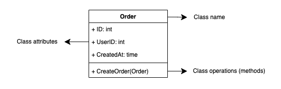

# Class Diagram

 

## Overview

Before we learn about **Class Diagram**, we need to know the **UML Diagram** strcuture first. Because, **UML Diagram** has derivatives.
In this case, **UML Diagram** has 2 types (Structural & Behavioral) diagram.

We won't learn about **UML Diagram** in here. We will focus on **Class Diagram**. With **Class Diagram** we able to imagine the system as a blueprint.
The blueprint will maps out attributes, methods, & relationships between classes. So, you can analyse **concept of model** that you want before you start coding.

### Class Notation

Class will represent every component like **class name**, **class attributes**, & **class operations** (methods).

## Reference

Title | URL
--- | ---
What is Class Diagram? | <https://www.visual-paradigm.com/guide/uml-unified-modeling-language/what-is-class-diagram/>
UML Class Diagram Tutorial | <https://www.visual-paradigm.com/guide/uml-unified-modeling-language/uml-class-diagram-tutorial/>
Class diagrams | <https://www.ibm.com/docs/en/rsm/7.5.0?topic=structure-class-diagrams>
UML class diagram arrow types: explanations and examples | <https://www.gleek.io/blog/class-diagram-arrows.html>
