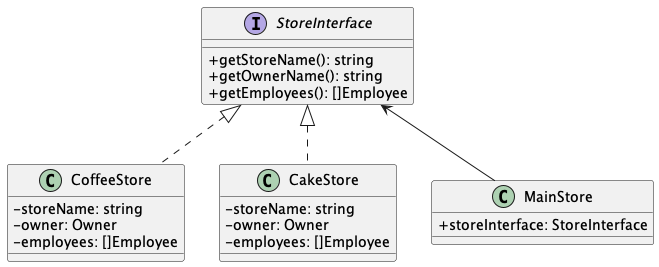
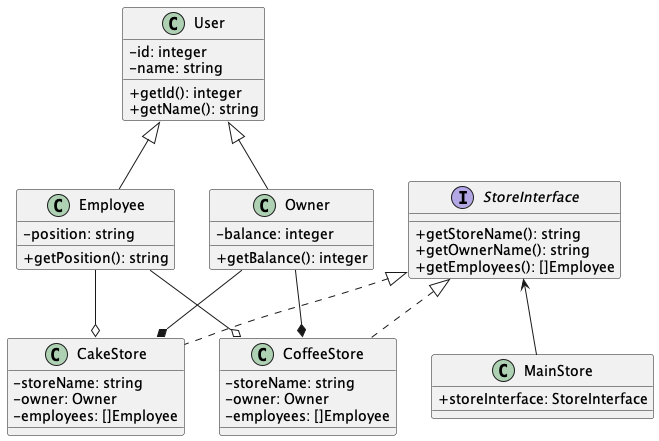

# Class Diagram

 

## Overview

Before we learn about **Class Diagram**, we need to know the **UML Diagram** strcuture first. Because, **UML Diagram** has derivatives.
In this case, **UML Diagram** has 2 types (Structural & Behavioral) diagram.

We won't learn about **UML Diagram** in here. We will focus on **Class Diagram**. With **Class Diagram** we able to imagine the system as a blueprint.
The blueprint will maps out attributes, methods, & relationships between classes. So, you can analyse **concept of model** that you want before you start coding.

## Class Notation

Class will represent every component like **class name**, **class attributes**, & **class operations** (methods).

## Class Visibility

Symbol | Mean
--- | ---
\+ | Public attributes or operations
\- | Private attributes or operations
\# | Protected attributes or operations

## Class Relationship

* Association

    Association is a standard relation between classes.

    

* Inheritance

    Inheritance is a relation between parent & child classes. Child class will inherit behavior of their parent.

    

* Realization (Implementation)

    Realization is a relation between class and interface. The interface will define functions and the class will create methods based on interface defined.

    

* Dependency

    Dependency is defined 2 classes having a relationship through interface. In this case, the child will be following the parent's behavior. So, if the parent has changed will be impacted the child's class.

    

* Aggregation

    Aggregation is a relationship between classes that isn't strict. If one class is removed, another class is still alive by itself.

    

* Composition

    Composition is really similar to aggregation. But, the relationship between classes is strict. The child class cannot be alive if the parent class is removed.

    

## Example

### Class Diagram of Store

### Implementation with Typescript

If you wanna see the full implementation, you can go to this [Code Implementation](./class_diagram/example.ts)

## Reference

Title | URL
--- | ---
Chat GPT | <https://chat.openai.com/chat>
What is a Class Diagram? | <https://www.visual-paradigm.com/guide/uml-unified-modeling-language/what-is-class-diagram/>
UML Class Diagram Tutorial | <https://www.visual-paradigm.com/guide/uml-unified-modeling-language/uml-class-diagram-tutorial/>
Class diagrams | <https://www.ibm.com/docs/en/rsm/7.5.0?topic=structure-class-diagrams>
UML class diagram arrow types: explanations and examples | <https://www.gleek.io/blog/class-diagram-arrows.html>

## Updates

Version | What is the update?
--- | ---
v1.1.0 | I update the diagram from used **diagrams.net** to **plantuml**. Because it's more easy to maintenance it with plantuml. And also, I detailed every example relation to more better context.
